% Life-history tradeoff example runs
% Karthik Ram
% `Wed May 23 12:41:53 2012`

<!-- Setting up R -->


```r
# Working with fecundity = 2
Fec2 <- all_plots[Fec == 2]
Fec2_plots <- dlply(Fec2, .(id), assemble_plots)
```


## Plots, page 1
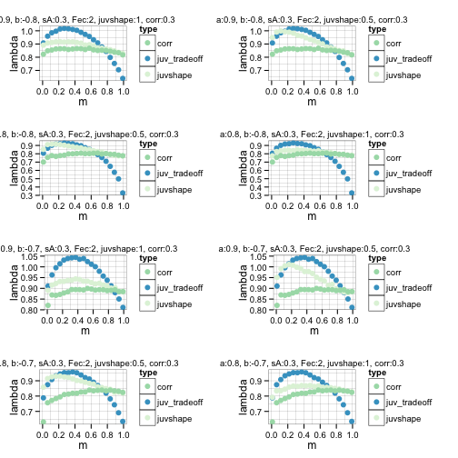 

 

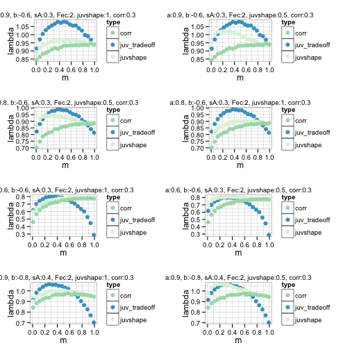 

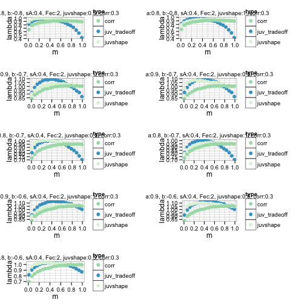 

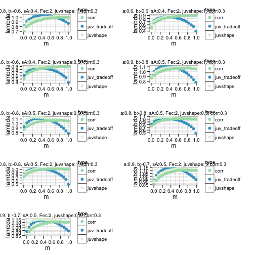 

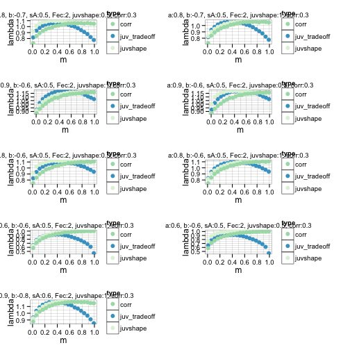 

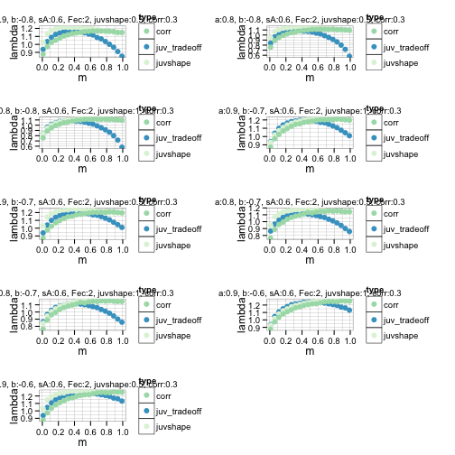 

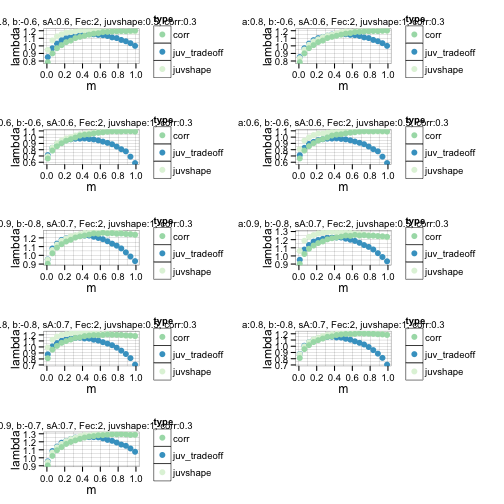 

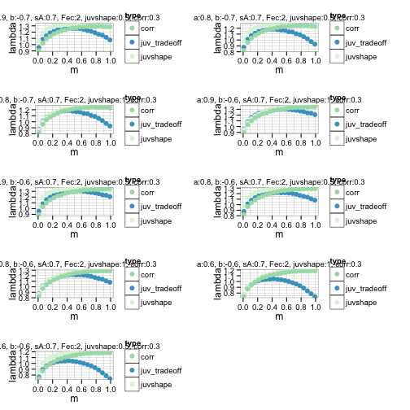 

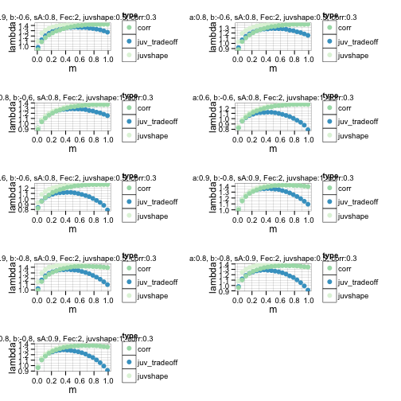 

 


```r
# Working with fecundity = 4
Fec4 <- all_plots[Fec == 4]
Fec4_plots <- dlply(Fec4, .(id), assemble_plots)
```


## Plots, cont..
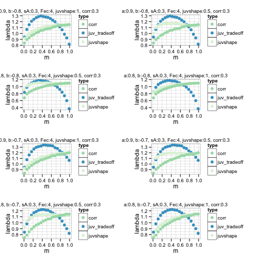 

 

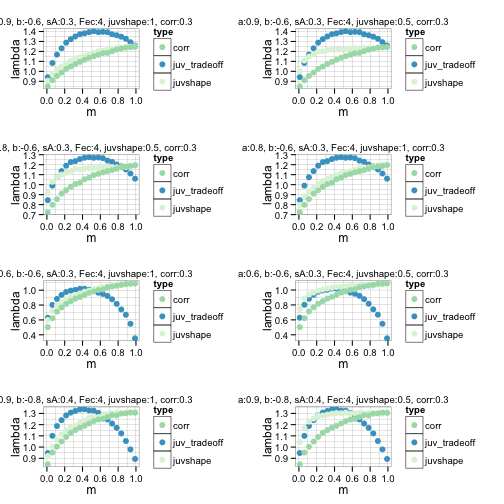 

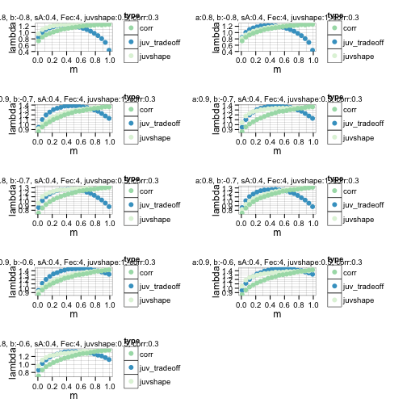 

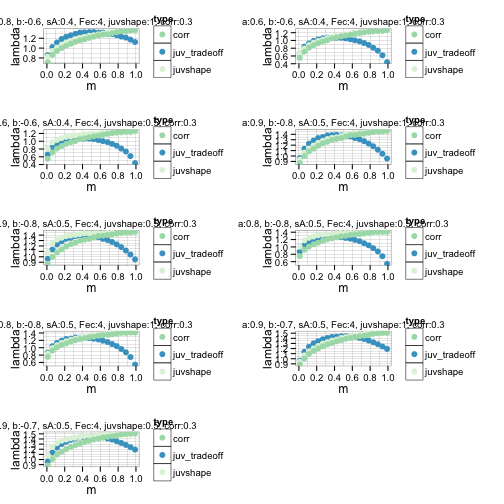 

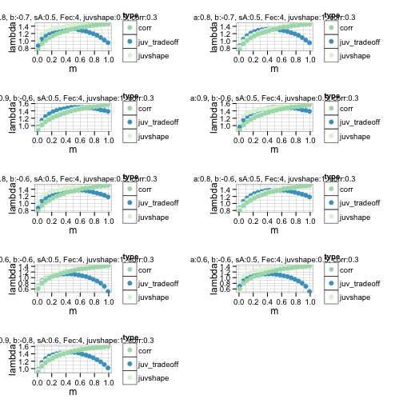 

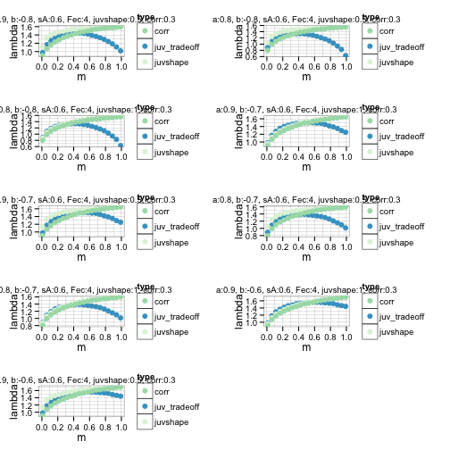 

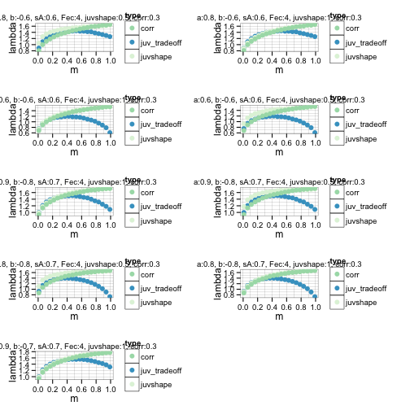 

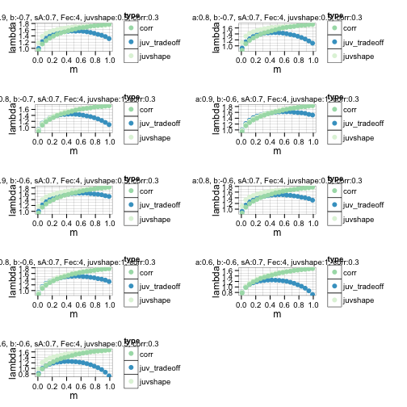 

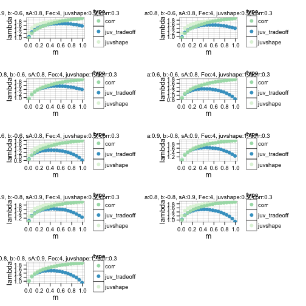 

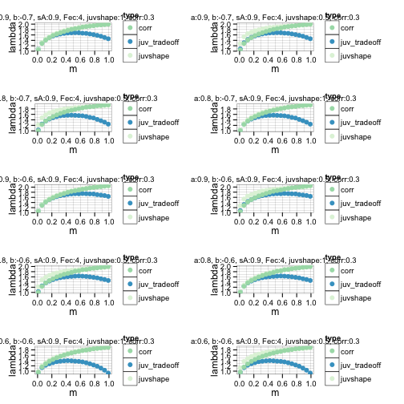 


```r
# Working with fecundity = 8
Fec8 <- all_plots[Fec == 8]
Fec8_plots <- dlply(Fec8, .(id), assemble_plots)
```


## Plots, cont..
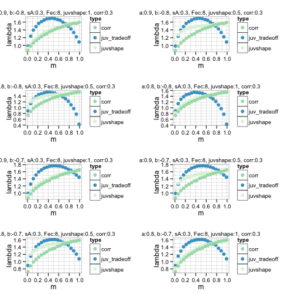 

 

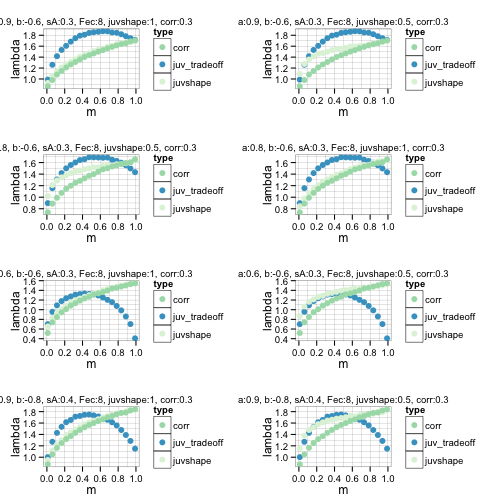 

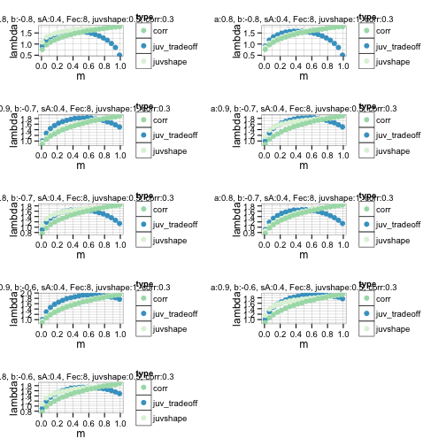 

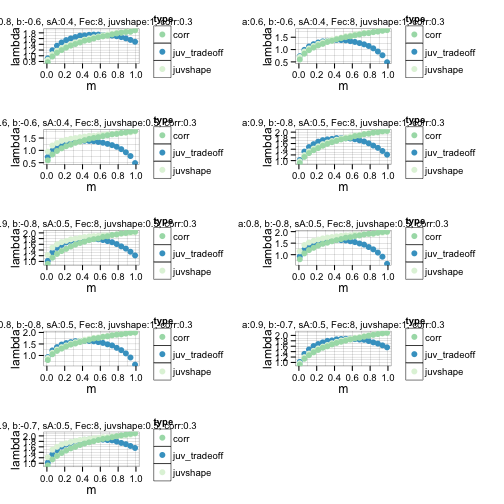 

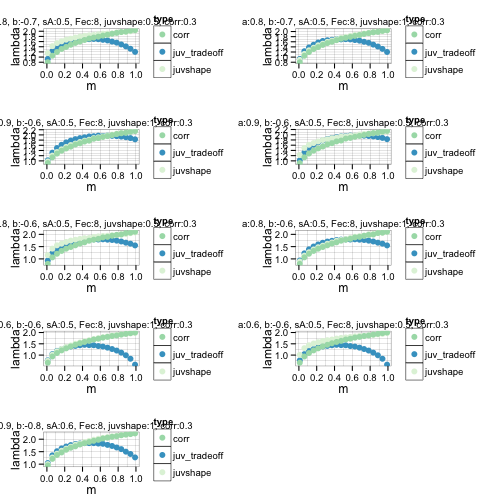 

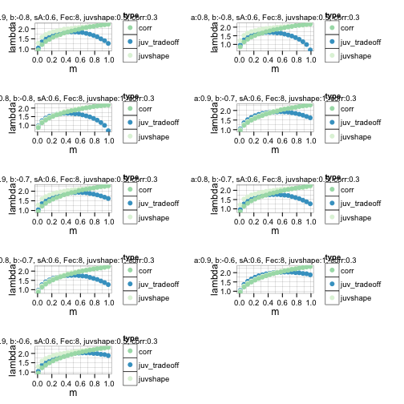 

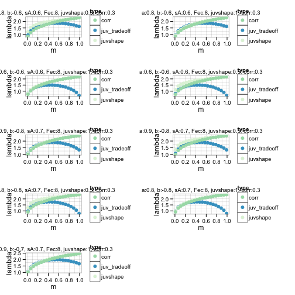 

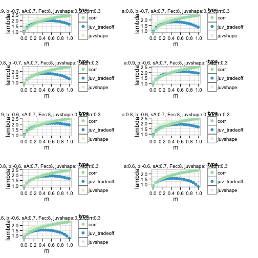 

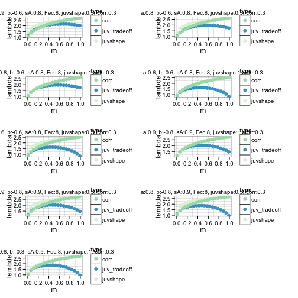 

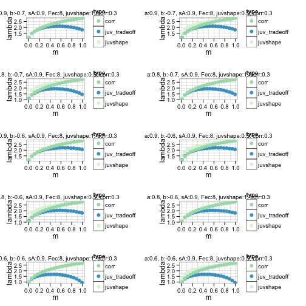 


```r
# Working with fecundity = 10
Fec10 <- all_plots[Fec == 10]
Fec10_plots <- dlply(Fec10, .(id), assemble_plots)
```


## Plots, cont..
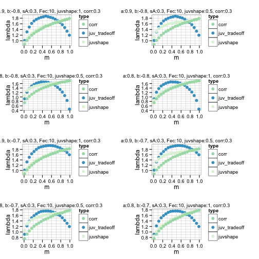 

 

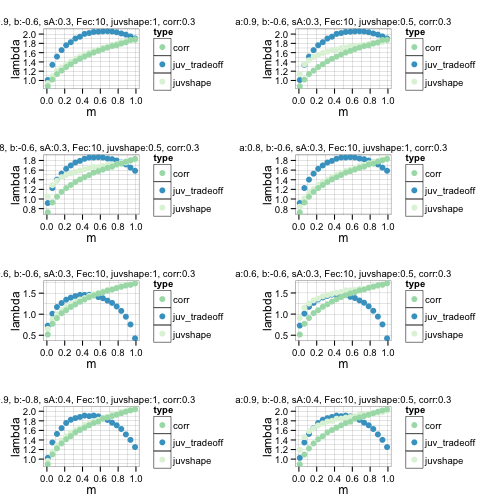 

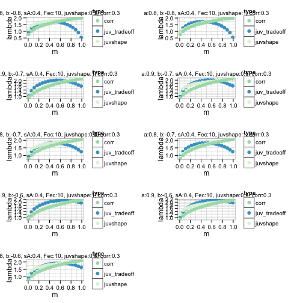 

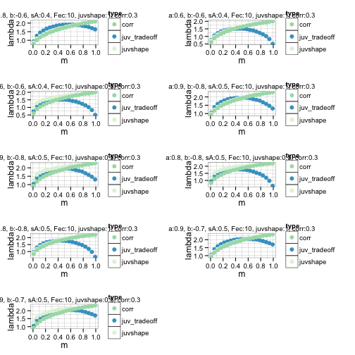 

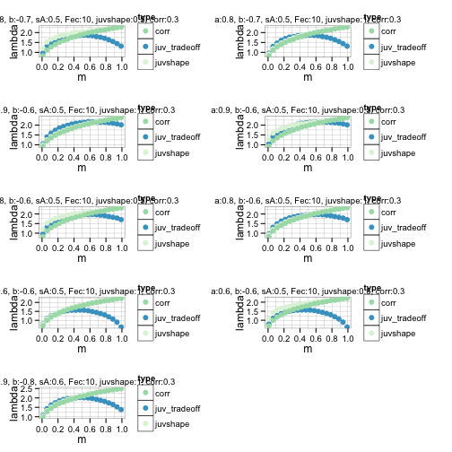 

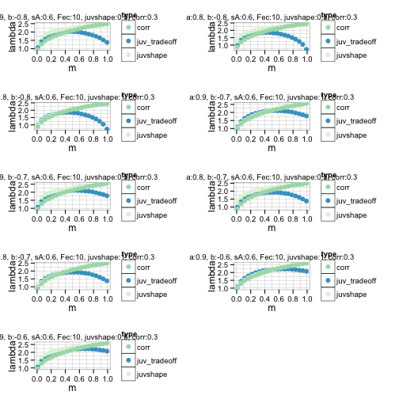 

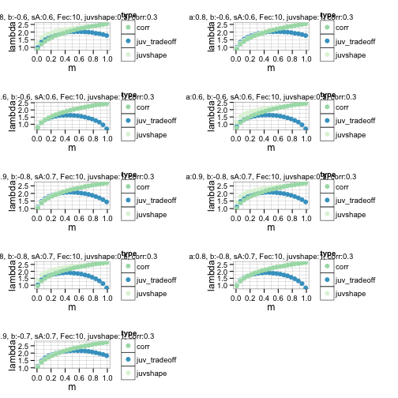 

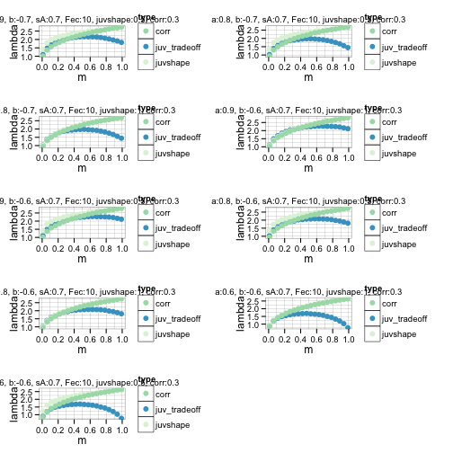 

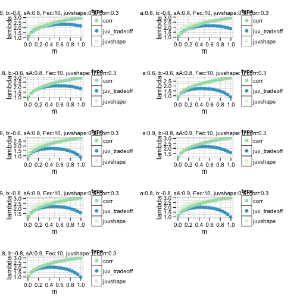 

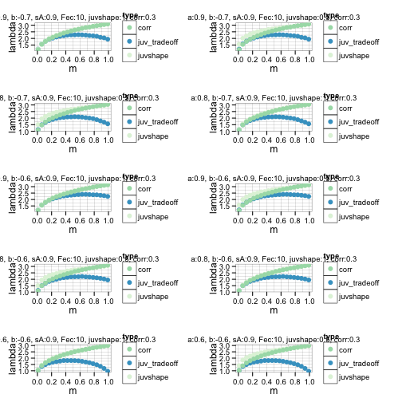 

