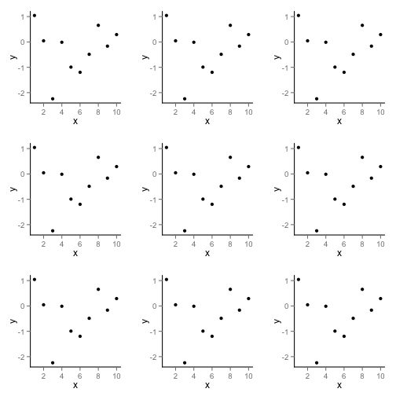

% Life-history tradeoff example runs
% Karthik Ram
% `Tue May 22 14:35:25 2012`

<!-- Setting up R -->


# Summary
In my attempts so far, I have set up and run various tradeoff scenarios. In my attempts so far, I have set up and run various tradeoff scenarios. The first set of scenarios look at tradeoffs between maturation rate `m` and juvenile survival `sJ`.

##1. Exploring tradeoffs between maturation rate and juvenile survival


### Generating an initial set of tradeoffs


```r
a <- 0.9
b <- -0.8
sA <- 0.7
Fec <- 2
parameters <- param_combs(a, b, sA, Fec)
```


Using the function `param_combs`, we have created a set of `1` combination(s).

### Simple case
First we fit the really simple matrix case.


```r
t1_simple <- llply(parameters, do_tradeoff)
```


### Results


```r
t1_simple
```


```
## [[1]]
## [[1]]$data
##          m     sJ lambda   type
## 1  0.01000 0.8920 0.9535 simple
## 2  0.06158 0.8507 1.0766 simple
## 3  0.11316 0.8095 1.1370 simple
## 4  0.16474 0.7682 1.1748 simple
## 5  0.21632 0.7269 1.1994 simple
## 6  0.26789 0.6857 1.2151 simple
## 7  0.31947 0.6444 1.2241 simple
## 8  0.37105 0.6032 1.2277 simple
## 9  0.42263 0.5619 1.2265 simple
## 10 0.47421 0.5206 1.2212 simple
## 11 0.52579 0.4794 1.2120 simple
## 12 0.57737 0.4381 1.1990 simple
## 13 0.62895 0.3968 1.1823 simple
## 14 0.68053 0.3556 1.1617 simple
## 15 0.73211 0.3143 1.1371 simple
## 16 0.78368 0.2731 1.1080 simple
## 17 0.83526 0.2318 1.0739 simple
## 18 0.88684 0.1905 1.0338 simple
## 19 0.93842 0.1493 0.9866 simple
## 20 0.99000 0.1080 0.9302 simple
## 
## [[1]]$params
## [[1]]$params$a
## [1] 0.9
## 
## [[1]]$params$b
## [1] -0.8
## 
## [[1]]$params$sA
## [1] 0.7
## 
## [[1]]$params$Fec
## [1] 2
## 
## [[1]]$params$sim_id
## [1] "S1"
## 
## 
## 
```


```r
df <- data.frame(x = 1:10, y = rnorm(10))
p1 <- ggplot(df, aes(x, y)) + geom_point()
plist <- list(p1, p1, p1, p1, p1, p1, p1, p1, p1)
n <- length(plist)
nCol <- floor(sqrt(n))
do.call("grid.arrange", c(plist, ncol = nCol))
```

 

